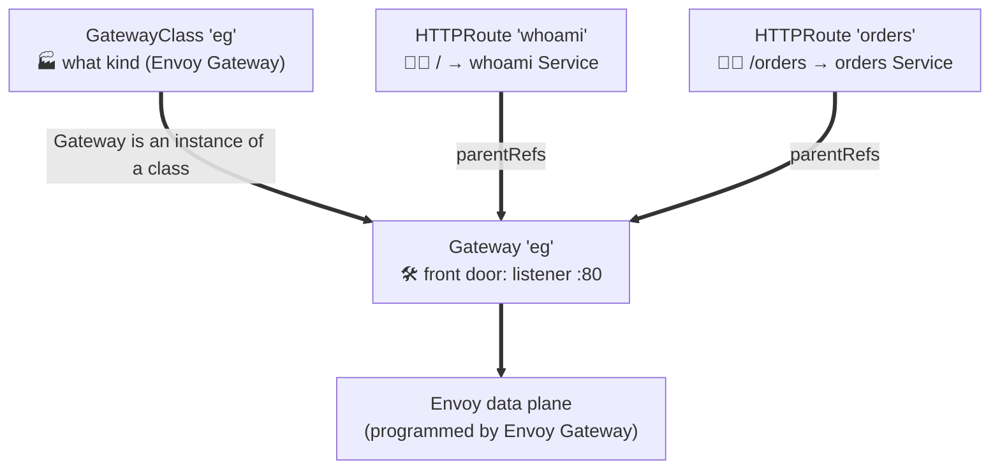

# Gateway API + Envoy Gateway — concepts, explained with one running example

This walks every core concept using a single app (`whoami`) that we grow step by step. The runnable manifests are the `0X-*.yaml` files next door; this file is the "why each piece exists." **Everything here is cloud-agnostic** — same on kind, AKS, EKS.

## The one idea
Old **Ingress** crammed the load balancer, TLS, and every team's routing rules into one annotation-heavy object. Not portable (annotations were vendor-specific), and one shared file everyone fought over. **Gateway API** fixes both by (a) splitting the job across **three roles** with their own objects, and (b) using a typed, portable spec instead of annotations. **Envoy Gateway** is one implementation — it runs Envoy as the data plane behind those objects.

---

## Concept 1 — Three personas, three resources ("Class → Gateway → Routes" = C-G-R)
Gateway API is designed around *who owns what*:

| Resource | Persona | Owns | In our example |
|---|---|---|---|
| **GatewayClass** | 🏭 Infra provider | *what kind* of gateway exists | `eg` → implemented by Envoy Gateway |
| **Gateway** | 🛠️ Platform team | the front door: listeners, ports, TLS | `eg` listening on :80 |
| **HTTPRoute** | 👩‍💻 App team | their own routing: host/path → Service | `whoami` route |

The win: app teams add/modify **Routes** all day without ever touching the platform's **Gateway**. Ingress couldn't express that boundary.



**Mnemonic:** *"Class makes the Gateway; teams attach the Routes."*

---

## Concept 2 — The Gateway's `listeners` (the front door's openings)
A **listener** is one protocol+port opening on the Gateway. It also controls *which routes are allowed to attach*.

```yaml
spec:
  gatewayClassName: eg
  listeners:
    - name: http
      protocol: HTTP        # HTTP | HTTPS | TLS | TCP | UDP
      port: 80
      allowedRoutes:
        namespaces:
          from: Same        # Same | All | Selector  → who may attach routes here
```
Key fields:
- **protocol/port** — what the door speaks.
- **hostname** (optional) — a listener can be scoped to `*.example.com`, so different teams' hostnames land on different listeners.
- **allowedRoutes** — the platform team's guardrail: `Same` (only this namespace), `All`, or `Selector` (label-matched namespaces). This is how the platform stays in control of its own front door.
- **tls** — for HTTPS/TLS listeners, references a cert `Secret` (see Concept 6).

---

## Concept 3 — Attachment & namespace boundaries (`parentRefs` + ReferenceGrant)
A route attaches *up* to a Gateway via **`parentRefs`**:
```yaml
# in the HTTPRoute
spec:
  parentRefs:
    - name: eg            # attach to Gateway 'eg' (same namespace by default)
```
Two safety rules worth knowing:
- The **Gateway's `allowedRoutes`** must permit the route's namespace (Concept 2).
- If a route wants a **backend in another namespace**, you need a **`ReferenceGrant`** in the target namespace explicitly allowing it. This stops a random namespace from routing traffic to a Service it shouldn't reach — a real multi-tenant guardrail.

```yaml
# ReferenceGrant lives in the BACKEND's namespace, granting access to it
apiVersion: gateway.networking.k8s.io/v1beta1
kind: ReferenceGrant
metadata:
  name: allow-demo-routes
  namespace: payments
spec:
  from:
    - group: gateway.networking.k8s.io
      kind: HTTPRoute
      namespace: demo
  to:
    - group: ""
      kind: Service        # demo's HTTPRoutes may target Services here
```

---

## Concept 4 — HTTPRoute anatomy: hostnames → rules → matches → filters → backendRefs
This is where the real routing lives. Grow our example to show each part:

```yaml
spec:
  parentRefs: [{ name: eg }]
  hostnames: ["www.example.com"]          # (1) match this Host header
  rules:
    - matches:                            # (2) when does this rule apply?
        - path: { type: PathPrefix, value: /orders }
          headers:
            - name: x-canary
              value: "true"               #     path /orders AND header x-canary:true
      filters:                            # (3) optional in-flight mutations
        - type: RequestHeaderModifier
          requestHeaderModifier:
            set: [{ name: x-env, value: prod }]
      backendRefs:                        # (4) where to send it (with weights)
        - { name: orders-v2, port: 80, weight: 10 }   # 10% canary
        - { name: orders-v1, port: 80, weight: 90 }   # 90% stable
```
- **(1) hostnames** — route-level host matching (intersected with the listener's hostname).
- **(2) matches** — `path` (Exact/PathPrefix/RegularExpression), `headers`, `method`, `queryParams`. Multiple matches = OR; fields within one match = AND. Most-specific match wins.
- **(3) filters** — mutate the request/response in flight: header modify, URL rewrite, redirect, request mirror, etc. — portable, no Envoy-specific config needed for the common cases.
- **(4) backendRefs + weights** — **traffic splitting / canary is first-class** (just weights), unlike Ingress where you needed controller-specific annotations.

---

## Concept 5 — Status conditions (how you *debug* it)
Every Gateway API object reports machine-readable status — this is your first stop when something's off:
- **GatewayClass**: `Accepted` (the controller recognizes it).
- **Gateway**: `Accepted` + **`Programmed`** (the data plane was actually configured / got an address).
- **HTTPRoute**: `Accepted` (attached to a parent) + **`ResolvedRefs`** (its backendRefs exist and are reachable).
```bash
kubectl get gateway -n demo eg -o yaml | yq '.status.conditions'
kubectl get httproute -n demo whoami -o yaml | yq '.status.parents'
```
**Interview-grade debugging line:** *"`Programmed=False` on the Gateway means the controller couldn't realize the data plane; `ResolvedRefs=False` on the route means a backend Service/port is wrong — I read the conditions before I touch anything."* (That reliability-first instinct is exactly Brian's language.)

---

## Concept 6 — What Envoy Gateway adds (the implementation layer)
Gateway API is just the *spec*. **Envoy Gateway** is the controller that makes it real:
- Watches GatewayClass/Gateway/Route objects whose `controllerName` is `gateway.envoyproxy.io/gatewayclass-controller`.
- For each Gateway, it **provisions an Envoy proxy data plane + a Service** and continuously translates your objects into Envoy (xDS) config.
- **TLS** on an HTTPS listener:
  ```yaml
  - name: https
    protocol: HTTPS
    port: 443
    tls:
      mode: Terminate
      certificateRefs: [{ name: www-tls-cert }]   # a Secret (e.g. from cert-manager)
  ```
- **Policy attachment** — Envoy Gateway's CRDs attach extra behavior to a Gateway/Route via `targetRef`, keeping the core route clean:
  - **ClientTrafficPolicy** — client-facing settings (TLS params, connection limits, header handling).
  - **BackendTrafficPolicy** — upstream behavior: rate limiting, retries, circuit breaking, load-balancing policy.
  - **SecurityPolicy** — authn/authz: JWT validation, OIDC, CORS, basic/ext auth.
  - **BackendTLSPolicy** (Gateway API native) — TLS to the upstream.
  - **EnvoyPatchPolicy / EnvoyExtensionPolicy** — raw xDS patches / Wasm when you need the escape hatch.

These are the "I need rate limiting / JWT auth / a canary with retries" answers — and they're declarative add-ons, not edits to the app team's HTTPRoute.

---

## Request lifecycle (tie it all together)
1. Client sends `GET /orders` with `Host: www.example.com` → hits the **Envoy data plane** (the Gateway's Service).
2. Envoy matches the **listener** (`:80`/host) → finds attached **HTTPRoutes**.
3. Route **matches** evaluate (path `/orders` + header) → **filters** run (header set) → **backendRefs** pick a backend by **weight** (canary).
4. Any attached **policies** apply (rate limit, auth, retries).
5. Envoy forwards to the chosen **Service → Pod**; response flows back.

---

## Gateway API vs Ingress (the one-screen comparison)
| | Ingress | Gateway API |
|---|---|---|
| Ownership | one object, everyone edits | split: Class / Gateway / Route |
| Portability | vendor annotations | typed, portable spec |
| Protocols | HTTP(S) only | HTTP, gRPC, TCP, UDP, TLS |
| Traffic split / header match | controller-specific annotations | first-class fields |
| Cross-namespace safety | none | ReferenceGrant |
| Extensibility | annotations | typed policy attachment |

## Recall
- **Roles:** *Class makes the Gateway; teams attach the Routes* (C-G-R).
- **HTTPRoute shape:** *hostnames → rules → (matches, filters, backendRefs)*.
- **Debug:** Gateway `Programmed`, Route `ResolvedRefs`.
- **Why for this job:** *one Envoy data plane, both clouds, routing written once* — that's "cloud-agnostic networking."
