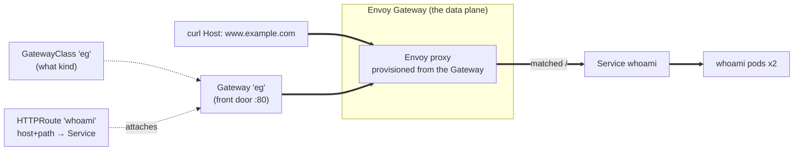

# Gateway API + Envoy Gateway — minimal, cloud-agnostic example

A complete "hello world" of Gateway API served by Envoy Gateway. **Nothing in the YAML is cloud-specific** — the same files run identically on kind, AKS, or EKS. The only place a cloud ever shows up is *how the Gateway's Service gets an external address*, and that's handled by the platform, not by these manifests. That portability **is** the point of the demo.

## The mental model — "Class → Gateway → Routes" (C-G-R)
Ownership descends infra → platform → apps. Each file maps to one role:

| File | Object | Owner | Plain-English |
|---|---|---|---|
| `01-gatewayclass.yaml` | **GatewayClass** | 🏭 Infra provider | *what kind* of gateway (Envoy Gateway). The only file naming the implementation. |
| `02-gateway.yaml` | **Gateway** | 🛠️ Platform team | *the front door* — listeners, ports, TLS. |
| `04-httproute.yaml` | **HTTPRoute** | 👩‍💻 App team | *who goes where* — host/path → Service. Self-served, never touches the Gateway. |
| `03-backend.yaml` | Deployment + Service | 👩‍💻 App team | the actual app (`traefik/whoami`, echoes which pod served). |

Recall: **"Class makes the Gateway, teams attach the Routes."** The *why*: **"Envoy = one proxy, both clouds, routing written once."**



## Prerequisites
- A Kubernetes cluster (kind / minikube / any). For a throwaway local one:
  ```bash
  kind create cluster --name gw-demo
  ```
- `kubectl` + `helm`.

## Step 1 — install Envoy Gateway (provides the controller + Gateway API CRDs)
```bash
helm install eg oci://docker.io/envoyproxy/gateway-helm \
  --version v1.2.1 \
  -n envoy-gateway-system --create-namespace

kubectl wait --timeout=5m -n envoy-gateway-system \
  deployment/envoy-gateway --for=condition=Available
```

## Step 2 — apply the example (in order)
```bash
kubectl apply -f 03-backend.yaml      # namespace + app first
kubectl apply -f 01-gatewayclass.yaml
kubectl apply -f 02-gateway.yaml
kubectl apply -f 04-httproute.yaml
```

## Step 3 — verify it programmed correctly
```bash
kubectl get gatewayclass eg                      # ACCEPTED=True
kubectl get gateway -n demo eg                   # see note below
kubectl get httproute -n demo whoami             # shows it attached to the Gateway
```

> **⚠️ On bare kind, the top-level Gateway `PROGRAMMED` stays `False` with reason `AddressNotAssigned`.** That's expected: the Gateway's Service is type `LoadBalancer`, and kind has no cloud LB controller to assign an external IP. **Traffic still works** — check `kubectl describe gateway -n demo eg` and you'll see the *listener* conditions are all `True` and the Envoy proxy pod is Running. On AKS/EKS the cloud assigns the IP and `PROGRAMMED` flips `True`. To make it `True` on kind too, install `cloud-provider-kind` (see Step 4 note). For this demo, port-forward works regardless.

## Step 4 — test it (cloud-agnostic: port-forward, no external LB needed)
Envoy Gateway creates a Service for your Gateway. Find it by its owner labels and port-forward — this works on **any** cluster, including kind, with no cloud load balancer:
```bash
ENVOY_SVC=$(kubectl get svc -n envoy-gateway-system \
  -l gateway.envoyproxy.io/owning-gateway-namespace=demo,gateway.envoyproxy.io/owning-gateway-name=eg \
  -o jsonpath='{.items[0].metadata.name}')

kubectl -n envoy-gateway-system port-forward "svc/$ENVOY_SVC" 8888:80 &

# Host header must match the HTTPRoute's hostname
curl --header "Host: www.example.com" http://localhost:8888/
```
You should see a `whoami` response naming the pod that served it. Re-run the curl a few times — it load-balances across the two replicas.

> **Optional — make `PROGRAMMED=True` on kind (nice for a demo/video):** install `cloud-provider-kind`, which hands `LoadBalancer` Services an external IP locally:
> ```bash
> go install sigs.k8s.io/cloud-provider-kind@latest   # or download the binary from the repo releases
> sudo ~/go/bin/cloud-provider-kind                    # leave running in its own terminal
> ```
> Within a few seconds `kubectl get gateway -n demo eg` shows an ADDRESS and `PROGRAMMED=True`, and you can `curl` that IP directly (still with the Host header) instead of port-forwarding. Not required for the demo to work.

## Cleanup
```bash
kubectl delete -f 04-httproute.yaml -f 02-gateway.yaml -f 01-gatewayclass.yaml -f 03-backend.yaml
helm uninstall eg -n envoy-gateway-system
kind delete cluster --name gw-demo   # if you used kind
```

## What makes this "as cloud-agnostic as possible"
- **Zero cloud annotations.** No `service.beta.kubernetes.io/aws-...` or Azure ingress annotations anywhere. Compare to classic Ingress, which needed cloud-specific annotations to do anything real.
- **One data plane everywhere.** Envoy Gateway runs the same Envoy proxy on AKS and EKS — you're not swapping AWS ALB Ingress for Azure AGIC.
- **The only cloud touch-point is the Gateway's Service type.** In a real cluster that Service is `LoadBalancer`; on a cloud it gets an external IP automatically, on kind you port-forward. Either way, *your manifests don't change* — which is exactly the "write routing once, run anywhere" story.
- **Clean ownership split** (GatewayClass / Gateway / Route) means app teams self-serve routes without editing the platform's front door — the platform-owned-vs-app-owned boundary Ingress couldn't express.

## Going further (talk-track, not needed to run)
- **TLS:** add an `https` listener on the Gateway referencing a `Secret` (cert via cert-manager) — still portable.
- **Traffic splitting / canary:** add a second `backendRef` with weights in the HTTPRoute.
- **East-west / mesh:** the same Gateway API extends to service mesh (GAMMA), converging north-south (gateway) and east-west (mesh) on one API.
